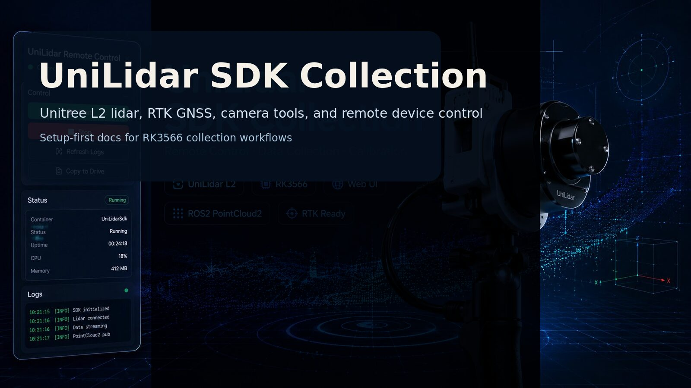
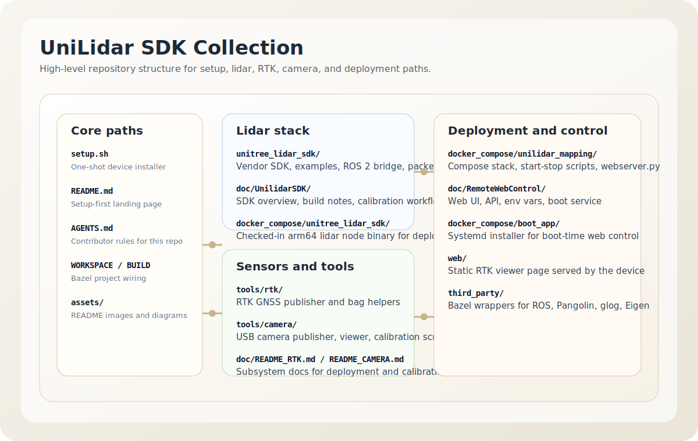
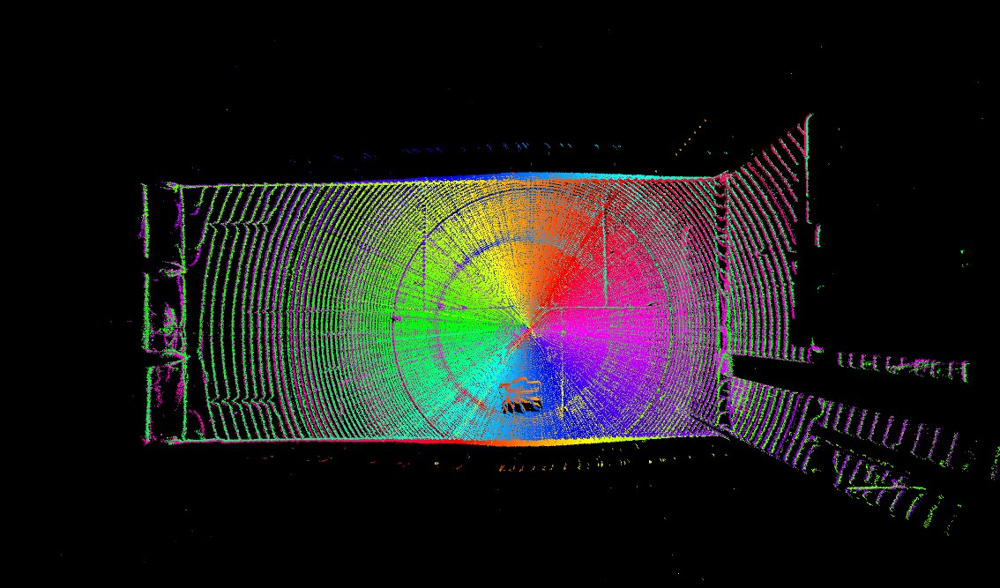
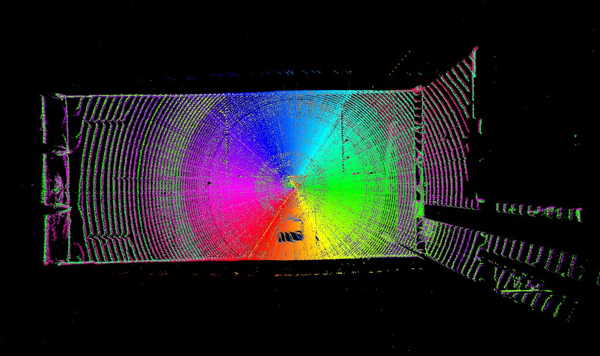
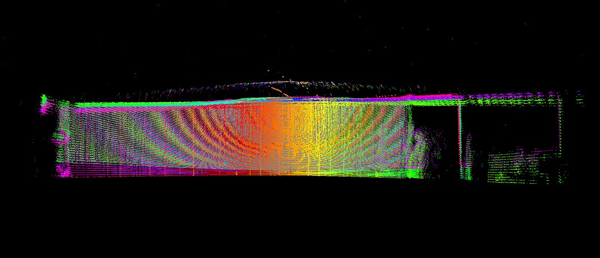
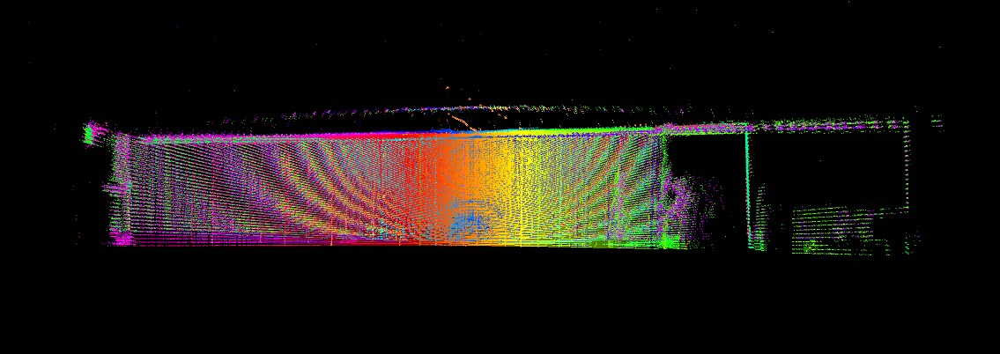

# UniLidar SDK Collection



UniLidar SDK Collection packages a Unitree L2 lidar workflow for RK3566-based
field collection: lidar capture, RTK GNSS, USB camera publishing, and a small
remote web control panel.



## What is in this repo

- `unitree_lidar_sdk/`: vendor SDK, examples, ROS 2 bridge, and offline packet tools
- `tools/rtk/`: RTK GNSS publisher and helpers
- `tools/camera/`: USB camera publisher, viewer, and calibration tools
- `docker_compose/`: compose stack, checked-in arm64 lidar binary, and boot service
- `web/`: static RTK viewer page

## Simple setup

```bash
mkdir -p ~/work
cd ~/work
git clone https://github.com/MapMindAI/unilidar_sdk2_bazel.git
cd unilidar_sdk2_bazel
sudo bash setup.sh
```

After setup, open `http://<device-ip>:8080/`.

`setup.sh` does three things:

1. installs serial and sudo rules for the collection device
2. sets the CPU governor to max performance
3. installs and starts the boot-time web control service

Re-login or reboot after the first run so the `dialout` group change takes effect.

## Main docs

- [Unitree Lidar SDK and calibration](doc/UnilidarSDK/README.md)
- [Remote web control](doc/RemoteWebControl/README.md)
- [RTK GNSS](doc/README_RTK.md)
- [Camera tools and calibration](doc/README_CAMERA.md)

## Unitree Lidar SDK

The lidar stack includes vendor headers and static libraries, example programs,
the `unitree_lidar_rosnode` ROS 2 bridge, and raw-packet tools for recording,
replay, and calibration.

Calibration is still a practical workflow rather than a one-click one. The
automatic plane-based optimizer exists, but manual replay tuning is still the
reliable path when you need the cleanest result. The full workflow and build
commands are in [doc/UnilidarSDK/README.md](doc/UnilidarSDK/README.md).

| View | Before | After |
|---|---|---|
| Top |  |  |
| Side |  |  |

## Remote web control

The repo ships with a small browser UI for starting and stopping the compose
stack, checking logs, running utility scripts, and editing the lidar
calibration values stored in the compose file.


See [doc/RemoteWebControl/README.md](doc/RemoteWebControl/README.md) for the
compose layout, web API, and boot-service path.

## Field workflow

- power the RK3566 device and connect lidar, RTK, and camera
- open the web control page from another machine
- start the compose stack
- confirm lidar, RTK, and camera topics from the logs or tools pane
- record and export data from the mounted drive


