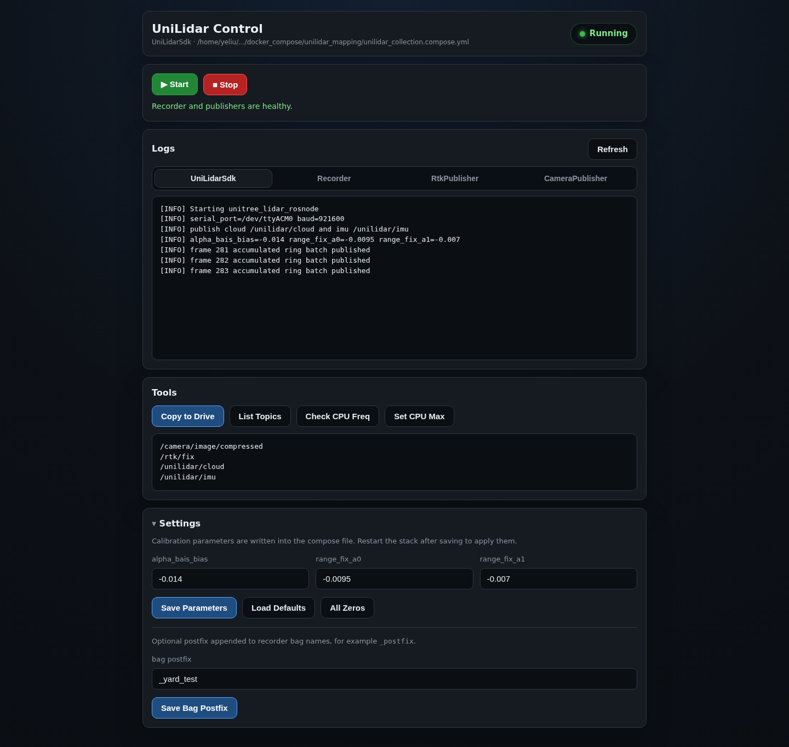

# Remote Web Control

The collection device exposes a small browser UI for controlling the Docker
stack and checking its runtime state.

## Layers

Three pieces work together:

1. `docker_compose/unilidar_mapping/unilidar_collection.compose.yml`
2. `docker_compose/unilidar_mapping/webserver.py`
3. `docker_compose/boot_app/enable_unilidar_web_boot.sh`

The compose stack runs lidar, recorder, RTK, and camera containers. The Python
web server provides the UI and JSON API. The boot script installs a systemd
unit so the web server comes back after reboot.

## Open the UI

Start the server with:

```bash
python3 docker_compose/unilidar_mapping/webserver.py
```

Then open `http://<device-ip>:8080/`.



## UI sections

- Header: running state, target container, and compose file
- Start / Stop: launch or stop the collection stack
- Logs: live tabs for `UniLidarSdk`, `Recorder`, `RtkPublisher`, and `CameraPublisher`
- Tools: copy to drive, list topics, check CPU frequency, and set max CPU frequency
- Settings: edit `alpha_bais_bias`, `range_fix_a0`, `range_fix_a1`, and recorder bag postfix

## Environment variables

| Variable | Default |
|---|---|
| `UNILIDAR_WEB_HOST` | `0.0.0.0` |
| `UNILIDAR_WEB_PORT` | `8080` |
| `UNILIDAR_COMPOSE_NAME` | `unilidar_collection` |
| `UNILIDAR_CONTAINER_NAME` | `UniLidarSdk` |

The start and stop scripts, copy script, and CPU tools can also be overridden
with environment variables. See `webserver.py` for the exact names.

## JSON API

| Method | Path | Purpose |
|---|---|---|
| `GET` | `/api/status` | stack status and target container |
| `GET` | `/api/logs?tail=N&container=NAME` | container logs |
| `GET` | `/api/params` | current lidar calibration values |
| `GET` | `/api/bag_suffix` | current recorder bag postfix |
| `POST` | `/api/start` and `/api/stop` | run the start or stop script |
| `POST` | `/api/copy` | export data with `tools/copy_to_drive.sh` |
| `POST` | `/api/topics` | run `ros2 topic list` in `UniLidarSdk` |
| `POST` | `/api/cpu_freq` and `/api/cpu_freq_max` | read or set CPU frequency |
| `POST` | `/api/params` and `/api/bag_suffix` | write settings back into the compose file |

## Boot service

Install the web server at boot with:

```bash
sudo bash docker_compose/boot_app/enable_unilidar_web_boot.sh
```

That script writes:

- `/etc/systemd/system/unilidar-web.service`
- `/etc/unilidar/rtk.env` if it does not already exist

Then it reloads systemd, enables the unit, and restarts it.
