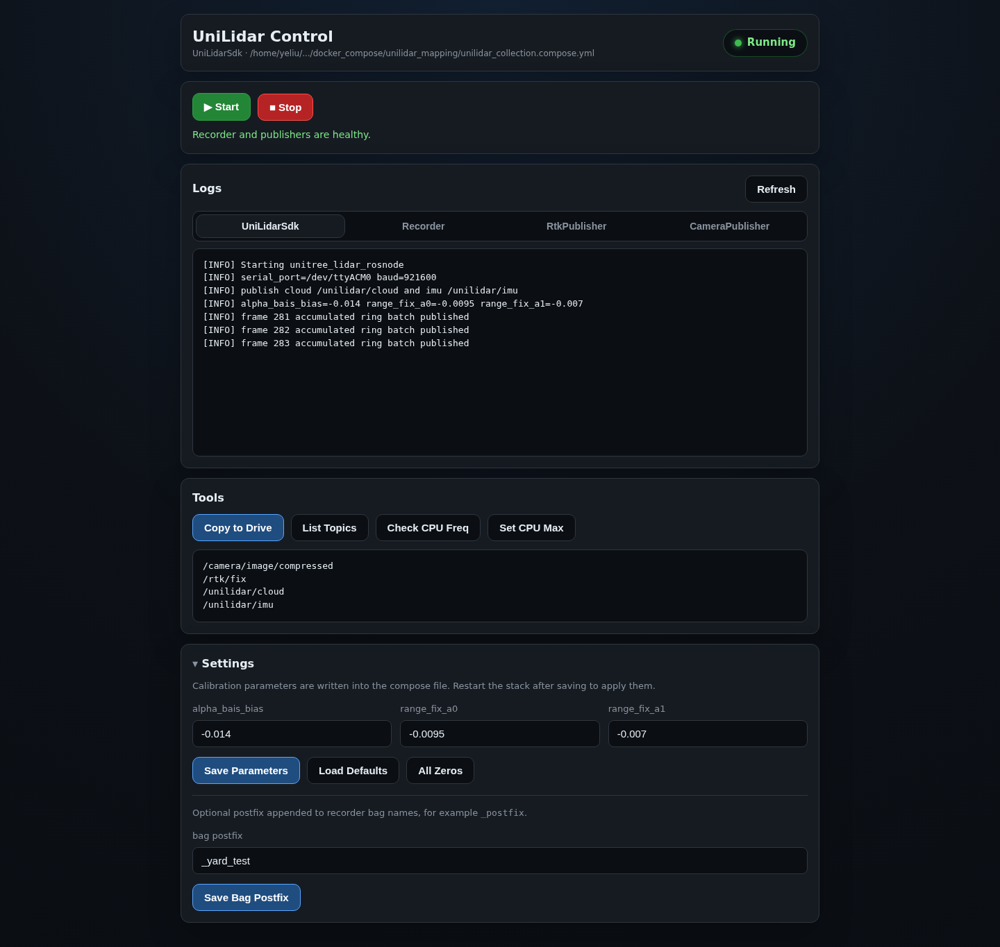

# Remote Web Control

The collection device exposes a small browser UI for controlling the Docker
stack and checking its runtime state.

## Layers

Three pieces work together:

1. `docker_compose/unilidar_mapping/unilidar_collection.compose.yml`
2. `docker_compose/unilidar_mapping/webserver.py`
3. `docker_compose/boot_app/enable_unilidar_web_boot.sh`

The compose stack runs lidar, recorder, RTK, and camera containers. The Python
web server provides the UI and JSON API. The boot script installs a systemd
unit so the web server comes back after reboot.

## Open the UI

Start the server with:

```bash
python3 docker_compose/unilidar_mapping/webserver.py
```

Then open `http://<device-ip>:8080/` for the UniLidar page, or
`http://<device-ip>:8080/mid360` for the Mid-360 collection page. Both pages
link to each other in their header.



## UI sections

### UniLidar Control (`/`)

- Header: running state, target container, and compose file
- Start / Stop: launch or stop the collection stack
- Logs: live tabs for `UniLidarSdk`, `Recorder`, `RtkPublisher`, and `CameraPublisher`
- Tools: copy to drive, list topics, check CPU frequency, and set max CPU frequency
- Settings: edit `alpha_bais_bias`, `range_fix_a0`, `range_fix_a1`, and recorder bag postfix

### Mid360 Collection (`/mid360`)

The Livox Mid-360 SDK/driver and its bag recorder run natively on the host
(ROS 2 Jazzy — see `doc/README_LIVOX.md`), not inside the humble docker
stack above, so this page manages them as plain background processes
rather than docker containers: each one's PID is written to a file under
`UNILIDAR_MID360_LOG_DIR`, which is how status/stop survive a webserver
restart without keeping anything in memory.

- Header: SDK and recorder running state
- Mid360 SDK: start/stop `tools/livox/start_livox_mid360.sh`
- Bag Recorder: start/stop `ros2 bag record` on `/livox/lidar`, `/livox/imu`,
  and the depth/infra1/infra2/vio camera topics (see `MID360_BAG_TOPICS` in
  `webserver.py`), writing timestamped bags under `data/rosbags_mid360/` —
  the bag name postfix field appends to the timestamped name, same idea as
  the UniLidar page's bag postfix setting
- Tools: check/set CPU frequency (same endpoints as the UniLidar page)
- Logs: live tabs for the SDK and the recorder; each ends with a
  `[... stopped, exit code N]` line when its process exits, whether from
  the Stop button or the process dying on its own

## Environment variables

| Variable | Default |
|---|---|
| `UNILIDAR_WEB_HOST` | `0.0.0.0` |
| `UNILIDAR_WEB_PORT` | `8080` |
| `UNILIDAR_COMPOSE_NAME` | `unilidar_collection` |
| `UNILIDAR_CONTAINER_NAME` | `UniLidarSdk` |
| `UNILIDAR_LIVOX_START_SCRIPT` | `tools/livox/start_livox_mid360.sh` |
| `UNILIDAR_MID360_ROS_DISTRO` | `jazzy` |
| `UNILIDAR_MID360_WS` | `~/ws_livox` (must match `LIVOX_WS` in `start_livox_mid360.sh`) |
| `UNILIDAR_MID360_BAG_DIR` | `data/rosbags_mid360` |
| `UNILIDAR_MID360_LOG_DIR` | `<tmp>/unilidar_mid360` |

The start and stop scripts, copy script, and CPU tools can also be overridden
with environment variables. See `webserver.py` for the exact names.

## JSON API

| Method | Path | Purpose |
|---|---|---|
| `GET` | `/api/status` | stack status and target container |
| `GET` | `/api/logs?tail=N&container=NAME` | container logs |
| `GET` | `/api/params` | current lidar calibration values |
| `GET` | `/api/bag_suffix` | current recorder bag postfix |
| `POST` | `/api/start` and `/api/stop` | run the start or stop script |
| `POST` | `/api/copy` | export data with `tools/copy_to_drive.sh` |
| `POST` | `/api/topics` | run `ros2 topic list` in `UniLidarSdk` |
| `POST` | `/api/cpu_freq` and `/api/cpu_freq_max` | read or set CPU frequency |
| `POST` | `/api/params` and `/api/bag_suffix` | write settings back into the compose file |
| `GET` | `/api/mid360/status` | Livox SDK and recorder running state |
| `GET` | `/api/mid360/logs?tail=N&target=sdk\|recorder` | SDK or recorder log tail |
| `POST` | `/api/mid360/start_sdk` and `/api/mid360/stop_sdk` | start/stop the Livox driver |
| `POST` | `/api/mid360/start_recorder` and `/api/mid360/stop_recorder` | start/stop the bag recorder |

## Boot service

Install the web server at boot with:

```bash
sudo bash docker_compose/boot_app/enable_unilidar_web_boot.sh
```

That script writes:

- `/etc/systemd/system/unilidar-web.service`
- `/etc/unilidar/rtk.env` if it does not already exist

Then it reloads systemd, enables the unit, and restarts it.
